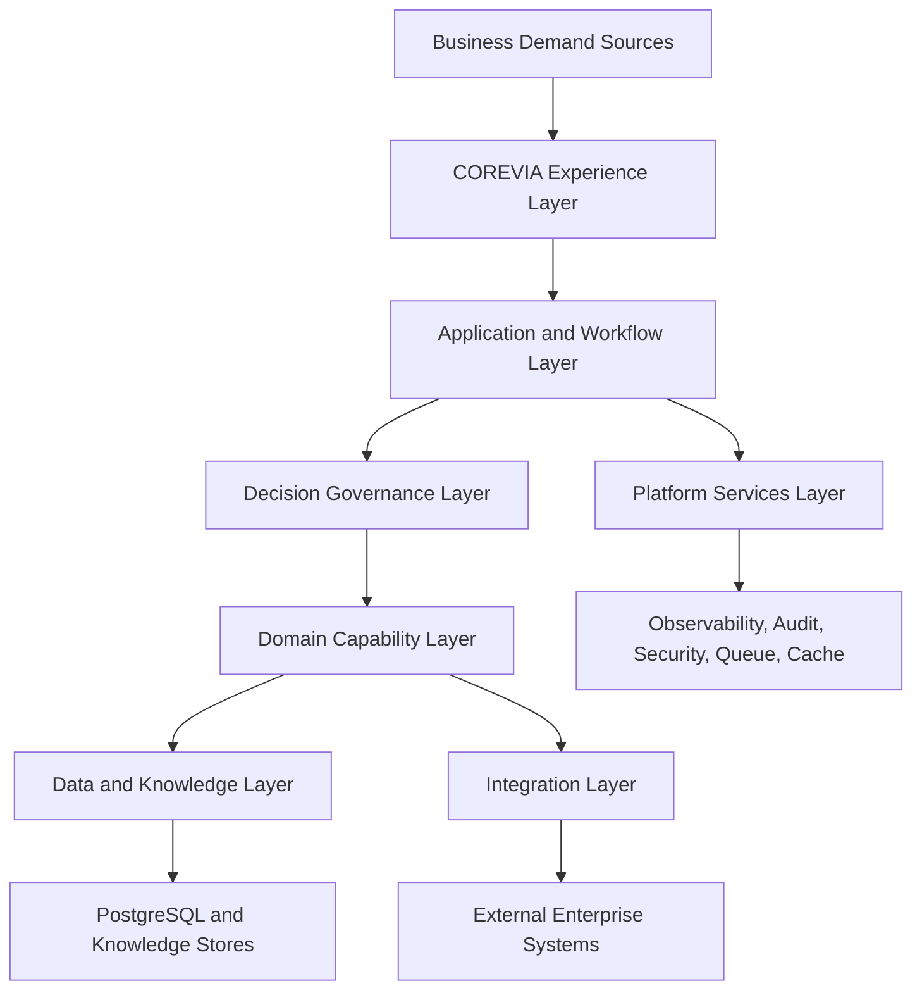
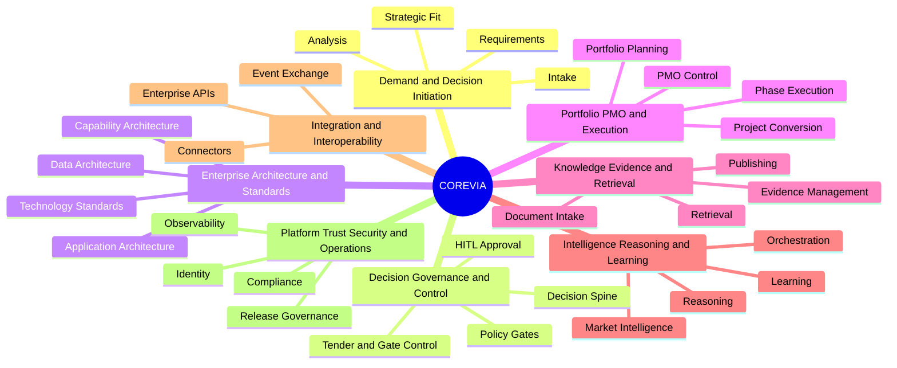
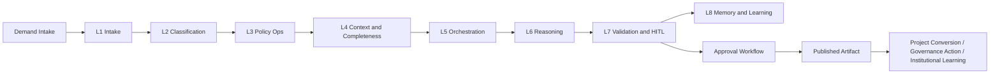
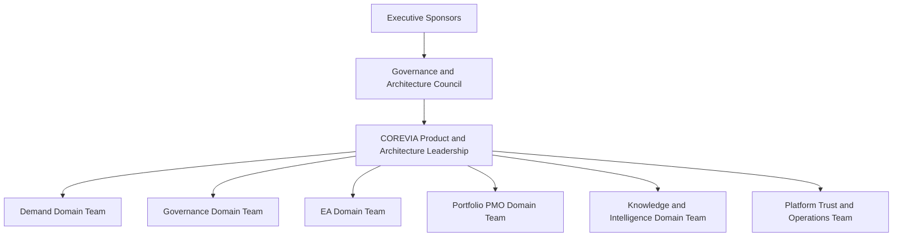

# COREVIA Executive Architecture Views

Date: 2026-03-10
Purpose: Provide executive-ready architecture views, visual models, and investor-level explanations.

## 1. Executive Narrative

COREVIA is a governance-first enterprise decision platform.

It sits above fragmented demand, architecture review, approval workflows, and project delivery processes and turns them into one institutional system.

Its architectural advantage is that it combines:

- enterprise workflow control,
- architecture intelligence,
- AI governance,
- knowledge-backed reasoning,
- and portfolio execution continuity.

That makes COREVIA more defensible than a workflow app and more trustworthy than an ungoverned AI copilot.

## 2. Platform Context View

Executive explanation:

- COREVIA receives enterprise demand through business-facing workspaces.
- It governs decisions through one controlled AI and policy backbone.
- It persists evidence and artifacts in a structured enterprise data layer.
- It connects out to enterprise systems only through controlled integration surfaces.

## 3. Capability Map View

Executive explanation:

- COREVIA is a platform of enterprise capabilities, not a single workflow feature.
- Each branch represents a domain that can be governed, measured, and funded.

## 4. Decision Flow View

Executive explanation:

- AI is not used directly on raw demand.
- Every major decision passes through classification, policy, reasoning, validation, and approval checkpoints.
- This is the architecture mechanism that turns AI into an enterprise-safe decision system.

## 5. Target Operating Model View

Executive explanation:

- COREVIA needs a platform operating model, not a feature backlog managed in isolation.
- Domain teams own capability areas, but architecture and governance remain centrally coherent.

## 6. Investor-Level Explanation

COREVIA should be explained to investors as follows:

### What COREVIA Is

COREVIA is an enterprise decision infrastructure platform for government and highly regulated organizations.

### What Problem It Solves

Most institutions have fragmented demand intake, disconnected review processes, weak architecture governance, opaque approvals, and limited institutional memory.

COREVIA unifies those into one governed decision system.

### Why It Is Defensible

Its moat is not just software workflow. Its moat is the combination of:

- governance model,
- approval model,
- decision spine,
- architecture-to-execution continuity,
- and institutional learning controls.

### Why AI Matters Here

AI is used as a governed reasoning engine inside a policy and approval architecture, not as a free-form assistant.

That makes COREVIA more aligned to government and enterprise trust requirements.

## 7. Architecture Map for Executive Review

| View | Executive Question | COREVIA Answer |
| --- | --- | --- |
| Context View | What is the platform in the enterprise? | The enterprise decision operating system |
| Capability View | What does it enable? | Governed demand, decision, architecture, portfolio, and learning capabilities |
| Decision Flow View | How does trust happen? | Through classification, policy, validation, HITL, and approval |
| Operating Model View | How should it be run? | As a centrally governed platform with domain-owned capabilities |
| Technology View | Why this stack? | It balances speed, control, and sovereign-ready evolution |

## 8. Final Executive Statement

COREVIA is architected to become the control layer between institutional demand and institutional execution. Its core value is not that it generates outputs quickly, but that it enables organizations to make better, safer, more auditable decisions at scale.